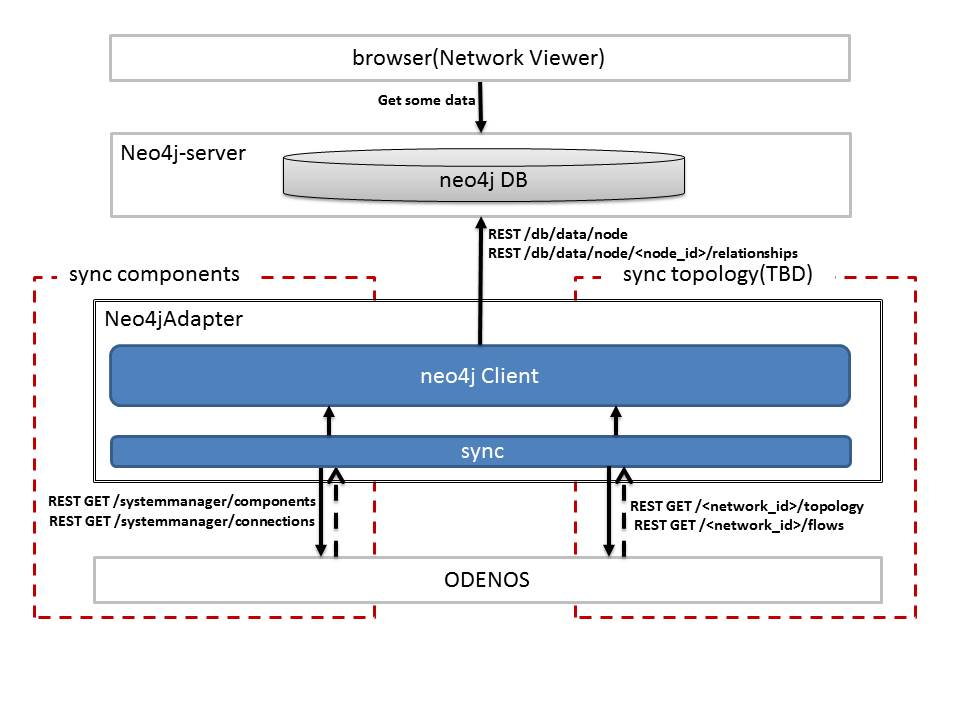

# neo4jAdapter
Visualize the ODENOS component configuration

# Screen shots

   

# Architecture

   

#Usage
```
 To reflect the component configuration of odenos to neo4j.
  > PYTHONPATH=../../lib/python/ ./neo4jsync.py

 To reflect the component configuration and topology of odenos to neo4j.
  > PYTHONPATH=../../lib/python/ ./neo4jsync.py topology
```
#Setup Neo4j

 1. Get&Install Neo4j-server http://neo4j.com/download/

   

 2. Edit the following parameters in *./conf/neo4j-server.properties*
   * dbms.security.auth_enabled=false
   * org.neo4j.server.webserver.address=0.0.0.0

   

 3. Start Neo4j-server

   ```
   $ ./bin/neo4j start
   ```
 4. In a browser, open http://localhost:7474/

   

 5. configure Graph Style Sheet  

   drop file "./apps/neo4j/graphstyle.grass"

   

# View Graph


  1. Run ODENOS & example

   ```
   $ cd (ODENOS_HOME)
   $ ./odenos start
   $ ./apps/rest_sample/rest_sample.sh
   $ PYTHONPATH=./lib/python/ ./apps/neo4j/neo4jsync.py
   ```

  2. In a browser, open http://localhost:7474/

   * Click on the star mark  
   * General -> Get some data  
   * Click on the play mark  

   


