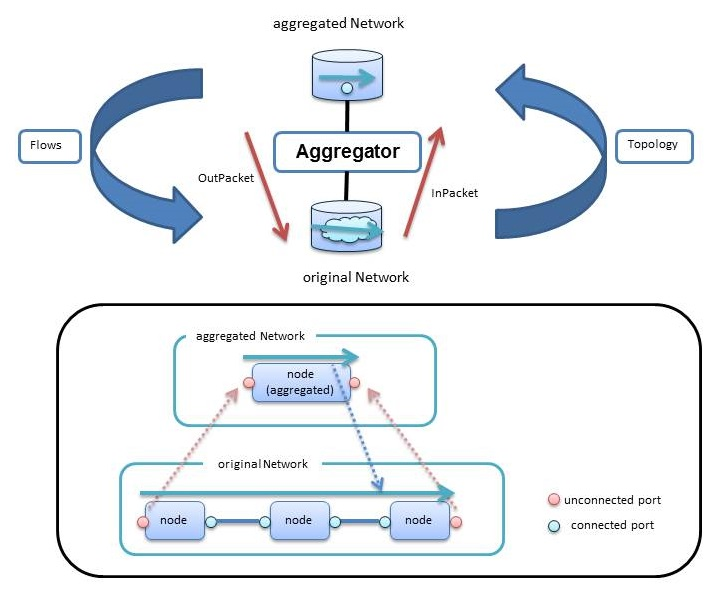


## Aggregator

Aggregator provides the ability to create aggregated Network in a single Node that consolidates the original network topology.

----

### Operating specifications of the Aggregator.

 * **Topology**  
 Aggregated Network in a single Node that consolidates the original network Topology.  
 Original network topology is composed of a single connected component.
 If more than one connected component exists, node of the  aggregated Network is "oper_status":"down".  
 Unconnected port is replicated to the aggregated network.
 Aggregator holds the correspondence between the topology, and performs the synchronization processing when there is a change.

 * **Flows**  
 Creates original flow(shortest path) from aggregated flow(Point-to-Point)   

 * **Packets**  
 InPackets from the Unconnected port to transfer from the original network to the aggregated network.  
 OutPackets from the Unconnected port to transfer from the aggregated network to the original network.  

* **Create Instance of Aggregator.**  
  Generate an instance of Aggregator by performing a PUT (or POST) to the System Manager.

  [PUT \<base_uri>/components/\<comp_id>](./SystemManager.md#PUTcomponents_id)

**key** | **value** | **description**                                   
--------|-----------|--------------
id      | \<String> |Unique Identifier in ODENOS.
type    | "Aggregator" |ObjectType
cm_id   | \<String> |Specify the [componentManager.Property.id](./DataClass.md#ObjectProperty) to generate an instance. (Optional)

* **Component Connections**  
  Connection of Aggregator and Network by performing a PUT (or POST) to the System Manager.

  network        | Connection possible number | connection_type 
-----------------|----------------------------|----------------------------------
original network | Only one                   | "original"
aggregated network| Only one                   | "aggregated"

  [PUT \<base_uri>/connections/\<conn_id>](./SystemManager.md#PUTconnections_id)

**key**          | **value**                  | **description**                                   
-----------------|----------------------------|---------------------------
id               | \<String>                  |Unique Identifier in ODENOS.    
type 　　 　     | "LogicAndNetwork"          |
connection_type  | "original" or  "aggregated"|                                                 
state            | none                       | default "initializing"
logic_id         | \<String>                  |aggregator ID                                 
network_id       | \<String>                  |Network ID                               

----

### REST APIs
  * [GET \<base_uri>/property](#GETproperty)
  * [PUT \<base_uri>/property](#PUTproperty)
  * [GET \<base_uri>/aggregated_nw_port](#GETaggregated_nw_port)
  * [GET \<base_uri>/original_nw_port](#GEToriginal_nw_port)
  * [GET \<base_uri>/aggregated_nw_flow](#GETaggregated_nw_flow)
  * [GET \<base_uri>/original_nw_flow](#GEToriginal_nw_flow)

----
#### <a name="GETproperty"> GET \<base_uri>/property</a>
  * **get Object property.**

##### [Request]:   
  * **Body** : none 

##### [Response]:
  * **Status Code** : 200
  * **Body** :  [ObjectProperty](./DataClass.md#ObjectProperty)
 
----
#### <a name="PUTproperty"> PUT \<base_uri>/property</a>
  * **update Object property.**

##### [Request]:   
  * **Body** :  [ObjectProperty](./DataClass.md#ObjectProperty)

##### [Response]:
  * **Status Code** : 200
  * **Body** :  [ObjectProperty](./DataClass.md#ObjectProperty)

----
#### <a name="GETaggregated_nw_port"> GET \<base_uri>/aggregated_nw_port</a>
**Get relationship of the aggregated port id and original port id.**
(Key is  original)

  * **get Object settings info.**

##### [Request]:   
  * **Body** : none 

##### [Response]:
  * **Status Code** : 200
  * **Body** : dict\<original_node_id::original_port_id, (aggregated_node_id, aggregated_port_id)>

----
#### <a name="GEToriginal_nw_port">GET \<base_uri>/original_nw_port</a>
**Get relationship of the aggregated port id and original port id.**
(Key is aggregated)

##### [Request]:   
  * **Body** : none 

##### [Response]:
  * **Status Code** : 200
  * **Body** : dict\<aggregated_node_id::aggregated_port_id, (original_node_id, original_port_id)>

----
#### <a name="GETaggregated_nw_flow">GET \<base_uri>/aggregated_nw_flow</a>
**Get relationship of the aggregated flow id and original flow id.**
(Key is  original)

##### [Request]:   
  * **Body** : none 

##### [Response]:
  * **Status Code** : 200
  * **Body** : dict\<original_flow_id, aggregated_flow_id>

----
#### <a name="GEToriginal_nw_flow">GET \<base_uri>/original_nw_flow</a>
**Get relationship of the aggregated flow id and original flow id.**
(Key is  aggregated)

##### [Request]:   
  * **Body** : none 

##### [Response]:
  * **Status Code** : 200
  * **Body** : dict\<aggregated_flow_id, original_flow_id>
