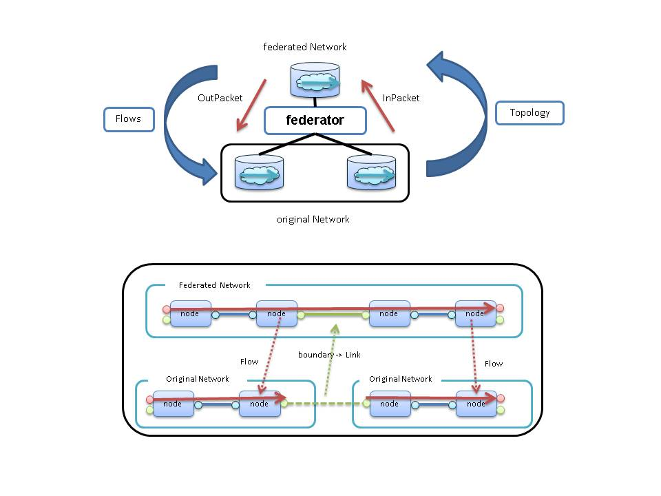


## Federator

Federater provide the ability to create a fedreted network to integrate original Network.

----

### Operating specifications of the Federator.

 * **Topology**  
 Federated network to create by integrating the original network.  
 Link in Federated network the original network It represent in baundarys.  
 Update topology in the original network is reflected in the sliver network.  

 * **Flows**  
 If you set the Flow to federated network, the Flow is reflected in original networks by Federator.original flow is split in consideration of the baundary.
 When flow status of the all original network is changed to "established", flow status of federated network is to change the "established".  

 * **Packets**  
 InPacket transfer from original network to federated network.  
 OutPacket transfer from federated network to original network.  
 If port_id of the InPacket matches any of the port_id of boundaries, Federator will drop it.  

 * **boundary**  
 Original network each other, are connected through the boundary information.  
 The boundary information is need on "network" and "node" and "port". 

* **Create Instance of Federator.**

  Generate an instance of Federator by performing a PUT(or POST) to the System Manager.

  [PUT \<base_uri>/components/\<comp_id>](./SystemManager.md#PUTcomponents_id)

**key** | **value** | **description**                                   
--------|-----------|--------------
id      | \<String> |Unique Identifier in ODENOS.
type    | "Federator" |ObjectType
cm_id   | \<String> |Specify the [componentManager.Property.id](./DataClass.md#ObjectProperty) to generate an instance. (Optional)

* **Component Connections**

  Connection of Federator and Network by performing a PUT(or POST) to the System Manager.

  network         | Connection possible number | connection_type 
------------------|----------------------------|----------------------------------
original network  | One or more                | "original"
federated network | Only one                   | "federated"

  [PUT \<base_uri>/connections/\<conn_id>](./SystemManager.md#PUTconnections_id)

**key**          | **value**              | **description**                                   
-----------------|------------------------|---------------------------
id               | \<String>              |Unique Identifier in ODENOS.    
type 　　 　     | "LogicAndNetwork"      |
connection_type  | "original" or  "federated"|                                                 
state            | none                   |default "initializing"
logic_id         | \<String>              |Federator ID                                 
network_id       | \<String>              |Network ID                               

----

### REST APIs
  * [GET \<base_uri>/property](#GETproperty)
  * [PUT \<base_uri>/property](#PUTproperty)
  * [GET \<base_uri>/settings](#GETsettings)
  * [GET \<base_uri>/settings/boundaries](#GETboundaries)
  * [POST \<base_uri>/settings/boundaries](#POSTboundaries)
  * [PUT \<base_uri>/settings/boundaries/\<boundary_id>](#PUTboundaries)
  * [DELETE \<base_uri>/settings/boundaries/\<boundary_id>](#DELETEboundaries)
  * [GET \<base_uri>/federated_network_node](#GETfederated_network_node)
  * [GET \<base_uri>/original_network_node](#GEToriginal_network_node)
  * [GET \<base_uri>/federated_network_port](#GETfederated_network_port)
  * [GET \<base_uri>/original_network_port](#GEToriginal_network_port)
  * [GET \<base_uri>/federated_network_link](#GETfederated_network_link)
  * [GET \<base_uri>/original_network_link](#GEToriginal_network_link)
  * [GET \<base_uri>/federated_network_flow](#GETfederated_network_flow)
  * [GET \<base_uri>/original_network_flow](#GEToriginal_network_flow)

----
#### <a name="GETproperty"> GET \<base_uri>/property</a>  
get Object property.  

##### [Request]:   
 * **Body** : none 

##### [Response]:
 * **Status Code** : 200
 * **Body** :  [ObjectProperty](./DataClass.md#ObjectProperty)
 
----
#### <a name="PUTproperty"> PUT \<base_uri>/property</a>  
update Object property.  

##### [Request]:   
 * **Body** :  [ObjectProperty](./DataClass.md#ObjectProperty)

##### [Response]:
  * **Status Code** : 200
  * **Body** :  [ObjectProperty](./DataClass.md#ObjectProperty)

----
#### <a name="GETsettings"> GET \<base_uri>/settings</a>  
Get Setting boundaries List, and relationship of the federated flow id and original flow id.  

##### [Request]:   
 * **Body** : none 

##### [Response]:
 * **Status Code** : 200
 * **Body** :  boundaries, federated_network_flow, original_network_flow

----
#### <a name="GETboundaries">GET \<base_uri>/settings/boundaries</a>  
Get Boundaries.  
Boundaries are Boundary control table.  
Boundaries are dict.(key:boundary_id, value:boundary object)  

##### [Request]:   
 * **Body** : none 

##### [Response]:
 * **Status Code** : 200
 * **Body** : dict<[FederatorBoundary](./DataClass.md#FederatorBoundary).id,  [FederatorBoundary](./DataClass.md#FederatorBoundary) >

----
#### <a name="POSTboundaries">POST \<base_uri>/settings/boundaries</a>  
Set Boundary.  \<boundary_id> is automatically assigned.  
after the send event to "ObjectSettingsChanged"  

##### [Request]:   
 * **Body** : [FederatorBoundary](./DataClass.md#FederatorBoundary)

##### [Response]:
 * **Status Code** : 200
 * **Body** : [FederatorBoundary](./DataClass.md#FederatorBoundary)

----
#### <a name="PUTboundaries">PUT \<base_uri>/settings/boundaries/\<boundary_id></a>  
Set Boundary. after the send event to "ObjectSettingsChanged"  

##### [Request]:   
 * **Body** : [FederatorBoundary](./DataClass.md#FederatorBoundary)

##### [Response]:
 * **Status Code** : 200
 * **Body** : [FederatorBoundary](./DataClass.md#FederatorBoundary)

----
#### <a name="DELETEboundaries">DELETE \<base_uri>/settings/boundaries/\<boundary_id></a>
**Delete Boundary. after the send event to "ObjectSettingsChanged"**

##### [Request]:   
 * **Body** : none 

##### [Response]:
 * **Status Code** : 200
 * **Body** : none 

----
#### <a name="GETfederated_network_node">GET \<base_uri>/federated_network_node</a>
**Get relationship of the federated node id and original node id.**
(Key is original)

##### [Request]:   
 * **Body** : none 

##### [Response]:
 * **Status Code** : 200
 * **Body** : dict\<original_network_id::original_node_id, federated_node_id>

----
#### <a name="GEToriginal_network_node">GET \<base_uri>/original_network_node</a>
**Get relationship of the federated node id and original node id.**
(Key is federated)

##### [Request]:   
 * **Body** : none 

##### [Response]:
 * **Status Code** : 200
 * **Body** : dict\<federated_node_id, (original_network_id, original_node_id)>

----
#### <a name="GETfederated_network_port">GET \<base_uri>/federated_network_port</a>
**Get relationship of the federated port id and original port id.**
(Key is original)

##### [Request]:   
 * **Body** : none 

##### [Response]:
 * **Status Code** : 200
 * **Body** : dict\<original_network_id::original_node_id::original_port_id, (federated_node_id, federated_port_id)>

----
#### <a name="GEToriginal_network_port">GET \<base_uri>/original_network_port</a>
**Get relationship of the federated port id and original port id.**
(Key is federated)

##### [Request]:   
 * **Body** : none 

##### [Response]:
 * **Status Code** : 200
 * **Body** : dict\<federated_node_id::federated_port_id, (original_network_id, original_node_id, original_port_id)> 

----
#### <a name="GETfederated_network_link">GET \<base_uri>/federated_network_link</a>
**Get relationship of the federated link id and original link id.**
(Key is original)

##### [Request]:   
 * **Body** : none 

##### [Response]:
 * **Status Code** : 200
 * **Body** : dict\<original_network_id::original_link_id, federated_link_id> 

----
#### <a name="GEToriginal_network_link">GET \<base_uri>/original_network_link</a>
**Get relationship of the federated link id and original link id.**
(Key is federated)

##### [Request]:   
 * **Body** : none 

##### [Response]:
 * **Status Code** : 200
 * **Body** : dict\<federated_link_id, (original_network_id, original_link_id)>

----
#### <a name="GETfederated_network_flow">GET \<base_uri>/federated_network_flow</a>
**Get relationship of the federated flow id and original flow id.**
(Key is original)

##### [Request]:   
 * **Body** : none 

##### [Response]:
 * **Status Code** : 200
 * **Body** : dict\<original_network_id::original_flow_id, federated_flow_id>

----
#### <a name="GEToriginal_network_flow">GET \<base_uri>/original_network_flow</a>
**Get relationship of the federated flow id and original flow id.**
(Key is federated)

##### [Request]:   
 * **Body** : none 

##### [Response]:
 * **Status Code** : 200
 * **Body** : dict\<federated_flow_id, list[(original_network_id, original_flow_id)]>

