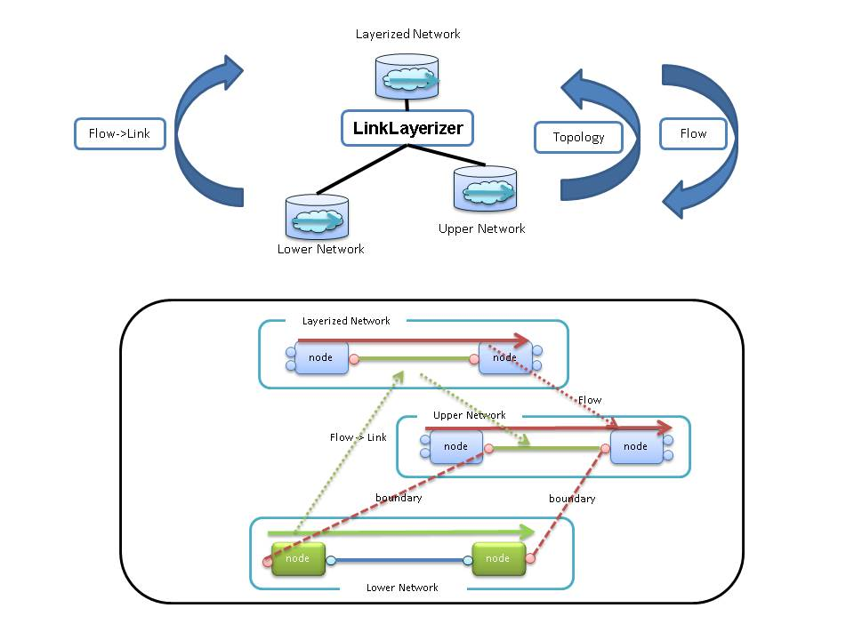


## LinkLayerizer

LinkLayerizer integrates networks of different layers, to create a multi-layer network.

----

Lower network : Topology of the lower layer in a multi-layer.(e.g. optical transport network)  
Upper network : Topology of the upper layer in a multi-layer.(e.g. Packet Transport network)  
Layerized network :Network topology that are available in the upper layer.  

### Operating specifications of the LinkLayerizer.

 * **Topology**  
  layerized network and the upper network, the same topology.  
  
 * **Flows**  
  Flow will be reflected in the upper network when it is set at layerized network.  
  flow of lower network that satisfies the condition(*) is converted to link of layerized network.  
  
  (*)Flow connecting the boundary port each other in the underlying network has been set.  

 * **Packets**  
  LinkLayerizer will drop it.

 * **boundary**  
 Lower network and upper network, are connected through the boundary information.  
 The boundary information is need on "network" and "node" and "port". 

* **Create Instance of LinkLayerizer.**

  Generate an instance of LinkLayerizer by performing a PUT(or POST) to the System Manager.

  [PUT \\<base_uri>/components/\\<comp_id>](./SystemManager.html#PUTcomponents_id)

**key** | **value** | **description**                                   
--------|-----------|--------------
id      | \<String> |Unique Identifier in ODENOS.
type    | "LinkLayerizer" |ObjectType
cm_id   | \<String> |Specify the [componentManager.Property.id](./DataClass.html#ObjectProperty) to generate an instance. (Optional)

* **Component Connections**

  Connection of LinkLayerizer and Network by performing a PUT( or POST) to the System Manager.

  network         | Connection possible number | connection_type 
------------------|----------------------------|----------------------------------
lower network     | Only one                   | "lower"
upper network     | Only one                   | "upper"
layerized network | Only one                   | "layerized"

  [PUT \\<base_uri>/connections/\\<conn_id>](./SystemManager.html#PUTconnections_id)

**key**          | **value**              | **description**                                   
-----------------|------------------------|---------------------------
id               | \<String>              |Unique Identifier in ODENOS.    
type 　　 　     | "LogicAndNetwork"      |
connection_type  | "lower" or  "upper" or "layerized" |                                                 
state            | none                   |default "initializing"
logic_id         | \<String>              |LinkLayerizer ID                                 
network_id       | \<String>              |Network ID                               

----

### REST APIs

  * [GET \\<base_uri>/property](#GETproperty)
  * [PUT \\<base_uri>/property](#PUTproperty)
  * [GET \\<base_uri>/settings](#GETsettings)
  * [GET \\<base_uri>/settings/boundaries](#GETboundaries)
  * [POST \\<base_uri>/settings/boundaries](#POSTboundaries)
  * [GET \\<base_uri>/settings/boundaries/\\<boundary_id>](#GETboundaries_id)
  * [PUT \\<base_uri>/settings/boundaries/\\<boundary_id>](#PUTboundaries_id)
  * [DELETE \\<base_uri>/settings/boundaries/\\<boundary_id>](#DELETEboundaries_id)
  * [PUT \\<base_uri>/settings/settings/upper_link_sync](#PUTupper_link_sync)
  * [GET \\<base_uri>/lower_flows](#GETlower_flows)
  * [GET \\<base_uri>/lower_flows/\\<link_id>](#GETlink_id)
  * [GET \\<base_uri>/layerized_links](#GETlayerized_links)
  * [GET \\<base_uri>/layerized_links/\\<flow_id>](#GETflow_id)

----
#### <a name="GETproperty"> GET \<base_uri>/property</a>  
get Object property.
##### [Request]:   
  * **Body** : none 
##### [Response]:
  * **Status Code** : 200
  * **Body** :  [ObjectProperty](./DataClass.html#ObjectProperty)
 
----
#### <a name="PUTproperty"> PUT \<base_uri>/property</a>  
update Object property.
##### [Request]:   
  * **Body** :  [ObjectProperty](./DataClass.html#ObjectProperty)
##### [Response]:
  * **Status Code** : 200
  * **Body** :  [ObjectProperty](./DataClass.html#ObjectProperty)

----
#### <a name="GETsettings"> GET \<base_uri>/settings</a>  
Get Setting boundaries List, and relationship of the federated flow id and original flow id.

##### [Request]:   
  * **Body** : none 
##### [Response]:
  * **Status Code** : 200
  * **Body** :  boundaries, federated_network_flow, original_network_flow

----
#### <a name="GETboundaries">GET \<base_uri>/settings/boundaries</a>  
Get Boundaries. Boundaries are Boundary control table. Boundaries are dict.(key:boundary_id, value:boundary object)

##### [Request]:
  * **Body** : none 
##### [Response]:
  * **Status Code** : 200
  * **Body** : dict < [LinkLayerizerBoundary](./DataClass.html#LinkLayerizerBoundary).id,
[LinkLayerizerBoundary](./DataClass.html#LinkLayerizerBoundary) >

----
#### <a name="POSTboundaries">POST \<base_uri>/settings/boundaries</a>  
Set Boundary.  \<boundary_id> is automatically assigned.  
after the send event to "ObjectSettingsChanged"  

##### [Request]:
  * **Body** : [LinkLayerizerBoundary](./DataClass.html#LinkLayerizerBoundary)
##### [Response]:
  * **Status Code** : 200
  * **Body** : [LinkLayerizerBoundary](./DataClass.html#LinkLayerizerBoundary)

----
#### <a name="GETboundaries_id">GET \<base_uri>/settings/boundaries/\<boundary_id></a>  
Get LinkLayerizer Boundary. 

##### [Request]:
  * **Body** : none 
##### [Response]:
  * **Status Code** : 200
  * **Body** : [LinkLayerizerBoundary](./DataClass.html#LinkLayerizerBoundary)

----
#### <a name="PUTboundaries_id">PUT \<base_uri>/settings/boundaries/\<boundary_id></a>  
Set Boundary. after the send event to "ObjectSettingsChanged"  

##### [Request]:
  * **Body** : [LinkLayerizerBoundary](./DataClass.html#LinkLayerizerBoundary)
##### [Response]:
  * **Status Code** : 200
  * **Body** : [LinkLayerizerBoundary](./DataClass.html#LinkLayerizerBoundary)

----
#### <a name="DELETEboundaries_id">DELETE \<base_uri>/settings/boundaries/\<boundary_id></a>  
Delete Boundary. after the send event to "ObjectSettingsChanged"  

##### [Request]:
  * **Body** : none 
##### [Response]:
  * **Status Code** : 200
  * **Body** : none 

----
#### <a name="PUTupper_link_sync">PUT \<base_uri>/settings/upper_link_sync</a>
If "True" To reflect the Link that you created in the layerized network to upper network.

##### [Request]:
  * **Body** : sync 
##### [Response]:
  * **Status Code** : 200
  * **Body** : sync true or false 

**key**   | **value**  | **description**
----------|------------|--------------
sync      | \<boolean> | "True":Reflect upper network link.(default)   "False":Does not reflect upper network link.

----
#### <a name="GETlower_flows">GET \<base_uri>/lower_flows</a>  
Get relationship of the layerized link id and original flow id. (Key is layerized link id)

##### [Request]:
  * **Body** : none 
##### [Response]:
  * **Status Code** : 200
  * **Body** : dict < [Link](./DataClass.html#Link).link_id, list [ [Flows](./DataClass.html#Flow).flow_id] >

----
#### <a name="GETlink_id">GET \<base_uri>/lower_flows/\<link_id></a>  
Get original flow_id corresponding to layerized link_id.

##### [Request]:
  * **Body** : none 
##### [Response]:
  * **Status Code** : 200
  * **Body** : list[[Flow](./DataClass.html#Flow).flow_id]

----
#### <a name="GETlayerized_links">GET \<base_uri>/layerized_links</a>
Get relationship of the layerized link_id and original flow_id. (Key is original flow_id)

##### [Request]:
  * **Body** : none 
##### [Response]:
  * **Status Code** : 200
  * **Body** : dict < [Flow](./DataClass.html#Flow).flow_id, [Link](./DataClass.html#Link).link_id >

----
#### <a name="GETflow_id">GET \<base_uri>/layerized_links/\<flow_id></a>  
Get layerized link_id corresponding to original flow_id.

##### [Request]:
  * **Body** : none 
##### [Response]:
  * **Status Code** : 200
  * **Body** : [Link](./DataClass.html#Link).link_id

