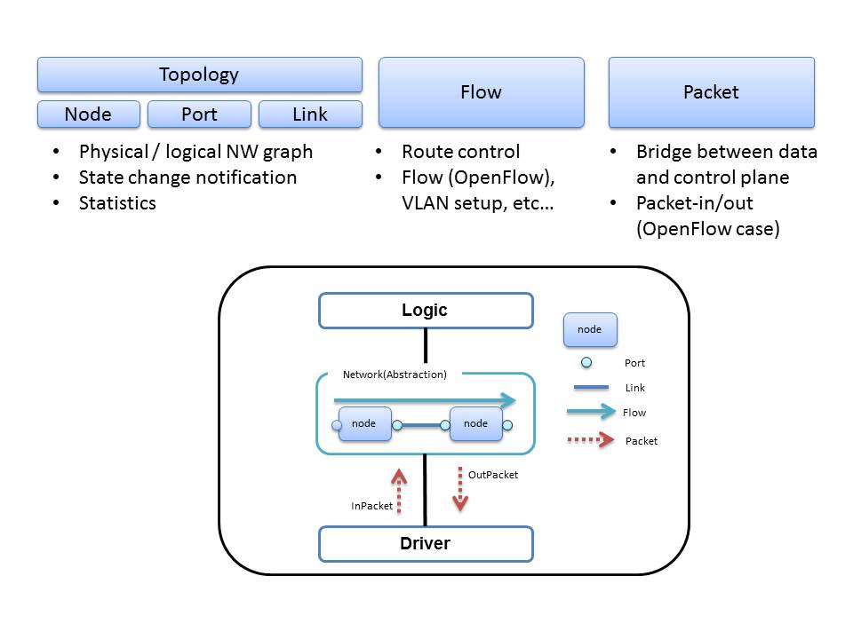

## Network

Network has a function of storing an object according to an abstract model of network.  
Network notifies the Event when there is a change in information.

### Network Abstraction Model  

### Operating specifications of the Network

* **Create Instance of Network.**  
  Generate an instance of Network by performing a POST to the System Manager.

  [POST \\<base_uri>/systemmanager/components](./SystemManager.html#POSTcomponents)

**key** | **value** | **description**                                   
--------|-----------|--------------
id      | \<String> |Unique Identifier in ODENOS.
type    | "Network" |ObjectType
cm_id   | \<String> |Specify the [componentManager.Property.id](./DataClass.html#ObjectProperty) to generate an instance. (Optional)

----

### REST APIs

 * Topology  

URI                                                     | GET                 | POST             |  PUT                        | DELETE                             
--------------------------------------------------------|---------------------|------------------|-----------------------------|--------------------  
 \<base_uri>/topology                                   | [Åõ](#GETtopology)  |                  | [Åõ](#PUTproperty)          |               
 \<base_uri>/topology/nodes                             | [Åõ](#GETnodes)     | [Åõ](#POSTnodes) |                             |        
 \<base_uri>/topology/nodes/\<node_id>                  | [Åõ](#GETnodes_id)  |                  | [Åõ](#PUTnodes_id)          | [Åõ](#DELETEnodes_id)
 \<base_uri>/topology/physical_nodes/\<physical_id>     | [Åõ](#GETnode_physical_id) |           | [Åõ](#PUTnode_physical_id)  | [Åõ](#DELETEnode_physical_id)      
 \<base_uri>/topology/nodes/\<node_id>/ports            | [Åõ](#GETports)     | [Åõ](#POSTports) |                             |   
 \<base_uri>/topology/nodes/\<node_id>/ports/\<port_id> | [Åõ](#GETport_id)   |                  | [Åõ](#PUTport_id)           | [Åõ](#DELETEport_id)
 \<base_uri>/topology/physical_ports/\<physical_id>     | [Åõ](#GETport_physical_id) |           | [Åõ](#PUTport_physical_id)  | [Åõ](#DELETEport_physical_id)
 \<base_uri>/topology/links                             | [Åõ](#GETlinks)     | [Åõ](#POSTlinks) |                             |
 \<base_uri>/topology/links/\<link_id>                  | [Åõ](#GETlink_id)   |                  | [Åõ](#PUTlink_id)           |[Åõ](#DELETElink_id)

 * Flows  

URI                             | GET               | POST             |  PUT              | DELETE                             
--------------------------------|-------------------|------------------|-------------------|-----------------  
  \<base_uri>/flows             | [Åõ](#GETflows)   | [Åõ](#POSTflows) |                   |
  \<base_uri>/flows/\<flow_id>  | [Åõ](#GETflow_id) |                  | [Åõ](#PUTflow_id) |[Åõ](#DELETEflow_id)

 * Packets  

URI                                    | GET                        | POST             |  PUT | DELETE                             
---------------------------------------|----------------------------|------------------|------|-----------------  
  \<base_uri>/packets                  | [Åõ](#GETpackets)          |                  |      | 
  \<base_uri>/packets/in               | [Åõ](#GETpackets_in)       | [Åõ](#POSTpackets_in) | | [Åõ](#DELETEpackets_in)
  \<base_uri>/packets/in/head          | [Åõ](#GETpackets_in_head)  |                  |      | [Åõ](#DELETEpackets_in_head)
  \<base_uri>/packets/in/\<packet_id>  | [Åõ](#GETpackets_in_id)    |                  |      | [Åõ](#DELETEpackets_in_id)
  \<base_uri>/packets/out              | [Åõ](#GETpackets_out)      | [Åõ](#POSTpackets_out) || [Åõ](#DELETEpackets_out)
  \<base_uri>/packets/out/head         | [Åõ](#GETpackets_out_head) |                  |      | [Åõ](#DELETEpackets_out_head)
  \<base_uri>/packets/out/\<packet_id> | [Åõ](#GETpackets_out_id)   |                  |      | [Åõ](#DELETEpackets_out_id)

##### Object property
  * [GET \\<base_uri>/property](#GETproperty)
  * [PUT \\<base_uri>/property](#PUTproperty)

##### Topology
  * [GET \\<base_uri>/topology](#GETtopology)
  * [PUT \\<base_uri>/topology](#PUTtopology)

##### Node
  * [POST \\<base_uri>/topology/nodes](#POSTnodes)
  * [GET \\<base_uri>/topology/nodes](#GETnodes)
  * [GET \\<base_uri>/topology/nodes/\\<node_id>](#GETnodes_id)
  * [PUT \\<base_uri>/topology/nodes/\\<node_id>](#PUTnodes_id)
  * [DELETE \\<base_uri>/topology/nodes/\\<node_id>](#DELETEnodes_id)
  * [GET \\<base_uri>/topology/physical_nodes/\\<physical_id>](#GETnode_physical_id)
  * [PUT \\<base_uri>/topology/physical_nodes/\\<physical_id>](#PUTnode_physical_id)
  * [DELETE \\<base_uri>/topology/physical_nodes/\\<physical_id>](#DELETEnode_physical_id)

##### Port
  * [POST \\<base_uri>/topology/nodes/\\<node_id>/ports](#POSTports)
  * [GET \\<base_uri>/topology/nodes/\\<node_id>/ports](#GETports)
  * [GET \\<base_uri>/topology/nodes/\\<node_id>/ports/\\<port_id>](#GETport_id)
  * [PUT \\<base_uri>/topology/nodes/\\<node_id>/ports/\\<port_id>](#PUTport_id)
  * [DELETE \\<base_uri>/topology/nodes/\\<node_id>/ports/\\<port_id>](#DELETEport_id)
  * [GET \\<base_uri>/topology/physical_ports/\\<physical_id>](#GETport_physical_id)
  * [PUT \\<base_uri>/topology/physical_ports/\\<physical_id>](#PUTport_physical_id)
  * [DELETE \\<base_uri>/topology/physical_ports/\\<physical_id>](#DELETEport_physical_id)

##### Link
  * [POST \\<base_uri>/topology/links](#POSTlinks)
  * [GET \\<base_uri>/topology/links](#GETlinks)
  * [GET \\<base_uri>/topology/links/\\<link_id>](#GETlink_id)
  * [PUT \\<base_uri>/topology/links/\\<link_id>](#PUTlink_id)
  * [DELETE \\<base_uri>/topology/links/\\<link_id>](#DELETElink_id)

##### Flow
  * [POST \\<base_uri>/flows](#POSTflows)
  * [GET \\<base_uri>/flows](#GETflows)
  * [GET \\<base_uri>/flows/\\<flow_id>](#GETflow_id)
  * [PUT \\<base_uri>/flows/\\<flow_id>](#PUTflow_id)
  * [DELETE \\<base_uri>/flows/\\<flow_id>](#DELETEflow_id)

##### Packet
  * [GET \\<base_uri>/packets](#GETpackets)
  * [POST \\<base_uri>/packets/in](#POSTpackets_in)
  * [GET \\<base_uri>/packets/in](#GETpackets_in)
  * [DELETE \\<base_uri>/packets/in](#DELETEpackets_in)
  * [GET \\<base_uri>/packets/in/head](#GETpackets_in_head)
  * [DELETE \\<base_uri>/packets/in/head](#DELETEpackets_in_head)
  * [GET \\<base_uri>/packets/in/\\<packet_id>](#GETpackets_in_id)
  * [DELETE \\<base_uri>/packets/in/\\<packet_id>](#DELETEpackets_in_id)
  * [POST \\<base_uri>/packets/out](#POSTpackets_out)
  * [GET \\<base_uri>/packets/out](#GETpackets_out)
  * [DELETE \\<base_uri>/packets/out](#DELETEpackets_out)
  * [GET \\<base_uri>/packets/out/head](#GETpackets_out_head)
  * [DELETE \\<base_uri>/packets/out/head](#DELETEpackets_out_head)
  * [GET \\<base_uri>/packets/out/\\<packet_id>](#GETpackets_out_id)
  * [DELETE \\<base_uri>/packets/out/\\<packet_id>](#DELETEpackets_out_id)

----
#### <a name="GETproperty"> GET \<base_uri>/property</a>  
get Object property.
##### [Request]:   
  * **Body** : none 
##### [Response]:
  * **Status Code** : 200
  * **Body** :  [ObjectProperty](./DataClass.html#ObjectProperty)
 
----
#### <a name="PUTproperty"> PUT \<base_uri>/property</a>  
update Object property.
##### [Request]:   
  * **Body** :  [ObjectProperty](./DataClass.html#ObjectProperty)
##### [Response]:
  * **Status Code** : 200
  * **Body** :  [ObjectProperty](./DataClass.html#ObjectProperty)

----
#### <a name="GETtopology">GET \<base_uri>/topology</a>  
get topology NetworkComponent

##### [Request]:   
  * **Body** : none 
##### [Response]:
  * **Status Code** : 200
  * **Body** : [Topology](./DataClass.html#Topology)

----
#### <a name="PUTtopology">PUT \<base_uri>/topology</a>  
update the entire topology.

##### [Request]:   
  * **Body** : [Topology](./DataClass.html#Topology)
##### [Response]:
  * **Status Code** : 200
  * **Body** : [Topology](./DataClass.html#Topology)

---- 
### <a name="POSTnodes">POST \<base_uri>/topology/nodes</a>  
add a Node to Network.id is granted automatically. (specified id is invalid)

##### [Request]:   
  * **Body** : [Node](./DataClass.html#Node)
##### [Response]:
  * **Status Code** : 200
  * **Body** : [Node](./DataClass.html#Node)

----
#### <a name="GETnodes">GET \<base_uri>/topology/nodes</a>  
Get node List.

##### [Request]:   
  * **Body** : none 
##### [Response]:
  * **Status Code** : 200
  * **Body** : dict {[Node](./DataClass.html#Node).id, [Node](./DataClass.html#Node)}

----
#### <a name="GETnodes_id">GET \<base_uri>/topology/nodes/\<node_id></a>  
get the node.  (specify the id that you want to get)

##### [Request]:   
  * **Body** : none 
##### [Response]:
  * **Status Code** : 200
  * **Body** : [Node](./DataClass.html#Node)

----
#### <a name="PUTnodes_id">PUT \<base_uri>/topology/nodes/\<node_id></a>  
update the node.(specify the id that you want to update)  
create a new node if id does not exist.

##### [Request]:   
  * **Body** : [Node](./DataClass.html#Node)

##### [Response]\(Updated):
  * **Status Code** : 200
  * **Body** : [Node](./DataClass.html#Node)

##### [Response]\(Created):
  * **Status Code** : 201
  * **Body** : [Node](./DataClass.html#Node)

----
#### <a name="DELETEnodes_id">DELETE \<base_uri>/topology/nodes/\<node_id></a>  
Delete the Node. (specify the id that you want to delete)  
can not delete if the link is set to port.

##### [Request]:   
  * **Body** : [Node](./DataClass.html#Node) or none
  * **Note** : If body is none, the deleted regardless of the version.
##### [Response]:
  * **Status Code** : 200
  * **Body** : none 
##### [Response]\(Conflict):
  * **Status Code** : 409
  * **Body** : [Node](./DataClass.html#Node) or none
  * **Note** : failure(Version mismatch, Link exists.)

----
#### <a name="GETnode_physical_id">GET \<base_uri>/topology/physical_nodes/\<physical_id></a>  
get the node.  (specify the physical id that you want to get)

##### [Request]:   
  * **Body** : none 
##### [Response]:
  * **Status Code** : 200
  * **Body** : [Node](./DataClass.html#Node)
  * **Note** : Physical ID is the only id in the system. If the same id exists, I will respond the first to found id.

----
#### <a name="PUTnode_physical_id">PUT \<base_uri>/topology/physical_nodes/\<physical_id></a>  
update the node.(specify the physical id that you want to update)  
create a new node if id does not exist.

##### [Response]\(Updated):
  * **Status Code** : 200
  * **Body** : [Node](./DataClass.html#Node)
##### [Response]\(Created):
  * **Status Code** : 201
  * **Body** : [Node](./DataClass.html#Node)

----
#### <a name="DELETEnode_physical_id">DELETE \<base_uri>/topology/physical_nodes/\<physical_id></a>  
Delete the Node. (specify the physical id that you want to delete)  
can not delete if the link is set to port.

##### [Request]:   
  * **Body** : [Node](./DataClass.html#Node) or none
  * **Note** : If body is none, the deleted regardless of the version.
##### [Response]:
  * **Status Code** : 200
  * **Body** : none 

##### [Response]\(Conflict):
  * **Status Code** : 409
  * **Body** : [Node](./DataClass.html#Node) or none
  * **Note** : failure(Version mismatch, Link exists.)

---- 
### <a name="POSTports">POST \<base_uri>/topology/nodes/\<node_id>/ports</a>  
add a Port to Node.id is granted automatically. (specified id is invalid)

##### [Request]:   
  * **Body** : [Port](./DataClass.html#Port)

##### [Response]:
  * **Status Code** : 200
  * **Body** : [Port](./DataClass.html#Port)

----
#### <a name="GETports">GET \<base_uri>/topology/nodes/\<node_id>/ports</a>  
Get port List.

##### [Request]:   
  * **Body** : none 
##### [Response]:
  * **Status Code** : 200
  * **Body** : dict{ [Port](./DataClass.html#Port).port_id, [Port](./DataClass.html#Port) }

----
#### <a name="GETport_id">GET \<base_uri>/topology/nodes/\<node_id>/ports/\<port_id></a>  
get the port.  (specify the id that you want to get)

##### [Request]:   
  * **Body** : none 
##### [Response]:
  * **Status Code** : 200
  * **Body** : [Port](./DataClass.html#Port)

----
#### <a name="PUTport_id">PUT \<base_uri>/topology/nodes/\<node_id>/ports/\<port_id></a>  
update the port.(specify the id that you want to update)  
create a new port if id does not exist.

##### [Request]:   
  * **Body** : [Port](./DataClass.html#Port)
##### [Response]\(Updated):
  * **Status Code** : 200
  * **Body** : [Port](./DataClass.html#Port)
##### [Response]\(Created):
  * **Status Code** : 201
  * **Body** : [Port](./DataClass.html#Port)

----
#### <a name="DELETEport_id">DELETE \<base_uri>/topology/nodes/\<node_id>/ports/\<port_id></a>  
Delete the port. (specify the id that you want to delete)  
can not delete if the link is set to port.

##### [Request]:   
  * **Body** : [Port](./DataClass.html#Port) or none
  * **Note** : If body is none, the deleted regardless of the version.
##### [Response]:
  * **Status Code** : 200
  * **Body** : none 
##### [Response]\(Conflict):
  * **Status Code** : 409
  * **Body** : [Port](./DataClass.html#Port) or none
  * **Note** : failure(Version mismatch, Link exists.)

----
#### <a name="GETport_physical_id">GET \<base_uri>/topology/physical_ports/\<physical_id></a>  
get the port.  (specify the physical id that you want to get)

##### [Request]:   
  * **Body** : none 
##### [Response]:
  * **Status Code** : 200
  * **Body** : [Port](./DataClass.html#Port)
  * **Note** : Physical ID is the only id in the system. If the same id exists, I will respond the first to found id.

----
#### <a name="PUTport_physical_id">PUT \<base_uri>/topology/physical_ports/\<physical_id></a>  
update the port.(specify the physical id that you want to update)  
create a new port if id does not exist.

##### [Request]:   
  * **Body** : [Port](./DataClass.html#Port)
##### [Response]\(Updated):
  * **Status Code** : 200
  * **Body** : [Port](./DataClass.html#Port)
##### [Response]\(Created):
  * **Status Code** : 201
  * **Body** : [Port](./DataClass.html#Port)

----
#### <a name="DELETEport_physical_id">DELETE \<base_uri>/topology/physical_ports/\<physical_id></a>  
Delete the port. (specify the physical id that you want to delete)  
can not delete if the link is set to port.

##### [Request]:   
  * **Body** : [Port](./DataClass.html#Port) or none
  * **Note** : If body is none, the deleted regardless of the version.
##### [Response]:
  * **Status Code** : 200
  * **Body** : none 
##### [Response]:
##### [Response]\(Conflict):
  * **Status Code** : 409
  * **Body** : [Port](./DataClass.html#Port) or none
  * **Note** : failure(Version mismatch, Link exists.)

---- 
### <a name="POSTlinks">POST \<base_uri>/topology/links</a>  
add a Link to Network.id is granted automatically. (specified id is invalid)

##### [Request]:   
  * **Body** : [Link](./DataClass.html#Link)
##### [Response]:
  * **Status Code** : 200
  * **Body** : [Link](./DataClass.html#Link)

----
#### <a name="GETlinks">GET \<base_uri>/topology/links</a>  
Get Link List.

##### [Request]:   
  * **Body** : none 
##### [Response]:
  * **Status Code** : 200
  * **Body** : dict{ [Link](./DataClass.html#Link).id, [Link](./DataClass.html#Link) }

----
#### <a name="GETlink_id">GET \<base_uri>/topology/links/\<link_id></a>  
get the link.  (specify the id that you want to get)

##### [Request]:   
  * **Body** : none 
##### [Response]:
  * **Status Code** : 200
  * **Body** : [Link](./DataClass.html#Link)

----
#### <a name="PUTlink_id">PUT \<base_uri>/topology/links/\<link_id></a>  
update the link.(specify the id that you want to update)  
create a new link if id does not exist.

##### [Request]:   
  * **Body** : [Link](./DataClass.html#Link)
##### [Response]\(Updated):
  * **Status Code** : 200
  * **Body** : [Link](./DataClass.html#Link)
##### [Response]\(Created):
  * **Status Code** : 201
  * **Body** : [Link](./DataClass.html#Link)

----
#### <a name="DELETElink_id">DELETE \<base_uri>/topology/links/\<link_id></a>  
Delete the link. (specify the id that you want to delete)

##### [Request]:   
  * **Body** : [Link](./DataClass.html#Link) or none
  * **Note** : If body is none, the deleted regardless of the version.
##### [Response]:
  * **Status Code** : 200
  * **Body** : none 
##### [Response]:
##### [Response]\(Conflict):
  * **Status Code** : 409
  * **Body** : [Port](./DataClass.html#Port) or none
  * **Note** : failure(Version mismatch)

---- 
#### <a name="POSTflows">POST \<base_uri>/flows</a>  
add a Flow to Network.id is granted automatically. (specified id is invalid)

##### [Request]:   
  * **Body** : [Flow](./DataClass.html#Flow)
##### [Response]:
  * **Status Code** : 200
  * **Body** : [Flow](./DataClass.html#Flow)

##### example(JSON)

    {
    "type": "BasicFlow",
    "owner": "xxxxxxxx",
    "enabled": true,
    "matches": [ {...(BasicFlowMatch)...} ]
    "path": ["LINK_ID1", "LINK_ID2"]
        "edge_actions": {
            "NODE_ID_1": [
                {...(BasicFlowAction)...},
                {...(BasicFlowAction)...},]    
        }    
    }

----
#### <a name="GETflows">GET \<base_uri>/flows</a>  
Get Flow List.

##### [Request]:   
  * **Body** : none 
##### [Response]:
  * **Status Code** : 200
  * **Body** : dict<Flow.id , : [Flow](./DataClass.html#Flow)

----
#### <a name="GETflow_id">GET \<base_uri>/flows/\<flow_id></a>  
get the flow.  (specify the id that you want to get)

##### [Request]:   
  * **Body** : none 
##### [Response]:
  * **Status Code** : 200
  * **Body** : [Flow](./DataClass.html#Flow)

----
#### <a name="PUTflow_id">PUT \<base_uri>/flows/\<flow_id></a>  
update the flow.(specify the id that you want to update)  
create a new flow if id does not exist.

##### [Request]:   
  * **Body** : [Flow](./DataClass.html#Flow)
##### [Response]\(Updated):
  * **Status Code** : 200
  * **Body** : [Flow](./DataClass.html#Flow)
##### [Response]\(Created):
  * **Status Code** : 201
  * **Body** : [Flow](./DataClass.html#Flow)

----
#### <a name="DELETEflow_id">DELETE \<base_uri>/flows/\<flow_id></a>  
Delete the flow. (specify the id that you want to delete)

##### [Request]:   
  * **Body** : [Flow](./DataClass.html#Flow) or none
  * **Note** : If body is none, the deleted regardless of the version.
##### [Response]:
  * **Status Code** : 200
  * **Body** : none 
##### [Response]\(Conflict):
  * **Status Code** : 409
  * **Body** : [Flow](./DataClass.html#Flow)
  * **Note** : failure(Version mismatch)

---- 
### <a name="GETpackets">GET \<base_uri>/packets</a>  
get the statistics of packets.

##### [Request]:   
  * **Body** : none 
##### [Response]:
  * **Status Code** : 200
  * **Body** : [PacketStatus](./DataClass.html#PacketStatus)

----
#### <a name="GETpackets_in">GET \<base_uri>/packets/in</a>  
get the statistics of InPackets.

##### [Request]:   
  * **Body** : none 
##### [Response]:
  * **Status Code** : 200
  * **Body** : [PacketStatus](./DataClass.html#PacketStatus)

----
#### <a name="POSTpackets_in">POST \<base_uri>/packets/in</a>  
add a InPacket to network. want to add to the queue of tail.

##### [Request]:   
  * **Body** : [InPacket](./DataClass.html#InPacket)
##### [Response]:
  * **Status Code** : 200
  * **Body** : [InPacket](./DataClass.html#InPacket)

----
#### <a name="DELETEpackets_in">DELETE \<base_uri>/packets/in</a>  
Delete all of the InPacket.

##### [Request]:   
  * **Body** : none 
##### [Response]:
  * **Status Code** : 200
  * **Body** : none 

----
#### <a name="GETpackets_in_head">GET \<base_uri>/packets/in/head</a>  
Get InPacket of the first.

##### [Request]:   
  * **Body** : none 
##### [Response]:
  * **Status Code** : 200
  * **Body** : [InPacket](./DataClass.html#InPacket)
##### [Response]:
  * **Status Code** : 204
  * **Body** : none 
  * **Note** : InPacket Not exist.

----
#### <a name="DELETEpackets_in_head">DELETE \<base_uri>/packets/in/head</a>  
Get InPacket and Delete OutPacket of the first.

##### [Request]:   
  * **Body** : none 
##### [Response]:
  * **Status Code** : 200
  * **Body** : [InPacket](./DataClass.html#InPacket)
##### [Response]:
  * **Status Code** : 204
  * **Body** : none 
  * **Note** : InPacket Not exist.

----
#### <a name="GETpackets_in_id">GET \<base_uri>/packets/in/\<packet_id></a>  
get the InPacket. (specify the physical id that you want to get)

##### [Request]:   
  * **Body** : none 
##### [Response]:
  * **Status Code** : 200
  * **Body** : [InPacket](./DataClass.html#InPacket)
##### [Response]:
  * **Status Code** : 404
  * **Body** : none 
  * **Note** : InPacket Not exist.

----
#### <a name="DELETEpackets_in_id">DELETE \<base_uri>/packets/in/\<packet_id></a>  
get the InPacket. and delete. (specify the physical id that you want to get)

##### [Request]:   
  * **Body** : none 
##### [Response]:
  * **Status Code** : 200
  * **Body** : [InPacket](./DataClass.html#InPacket)
##### [Response]:
  * **Status Code** : 404
  * **Body** : none 
  * **Note** : InPacket Not exist.

----
#### <a name="POSTpackets_out">POST \<base_uri>/packets/out</a>  
add a OutPacket to network. want to add to the queue of tail.

##### [Request]:   
  * **Body** : [OutPacket](./DataClass.html#OutPacket)
##### [Response]:
  * **Status Code** : 200
  * **Body** : [OutPacket](./DataClass.html#OutPacket)

----
#### <a name="GETpackets_out">GET \<base_uri>/packets/out</a>  
get the statistics of OutPackets.

##### [Request]:   
  * **Body** : none 
##### [Response]:
  * **Status Code** : 200
  * **Body** : [PacketStatus](./DataClass.html#PacketStatus)

----
#### <a name="DELETEpackets_out">DELETE \<base_uri>/packets/out</a>  
Delete all of the OutPacket.

##### [Request]:   
  * **Body** : none 
##### [Response]:
  * **Status Code** : 200
  * **Body** : none 

----
#### <a name="GETpackets_out_head">GET \<base_uri>/packets/out/head</a>  
Get OutPacket of the first.

##### [Request]:   
  * **Body** : none 
##### [Response]:
  * **Status Code** : 200
  * **Body** : [OutPacket](./DataClass.html#OutPacket)
##### [Response]:
  * **Status Code** : 204
  * **Body** : none 
  * **Note** : OutPacket Not exist.

----
#### <a name="DELETEpackets_out_head">DELETE \<base_uri>/packets/out/head</a>  
Get OutPacket and Delete OutPacket of the first.

##### [Request]:   
  * **Body** : none 
##### [Response]:
  * **Status Code** : 200
  * **Body** : [OutPacket](./DataClass.html#OutPacket)
##### [Response]:
  * **Status Code** : 204
  * **Body** : none 
  * **Note** : OutPacket Not exist.

----
#### <a name="GETpackets_out_id">GET \<base_uri>/packets/out/\<packet_id></a>  
get the OutPacket.(specify the physical id that you want to get)

##### [Request]:   
  * **Body** : none 
##### [Response]:
  * **Status Code** : 200
  * **Body** : [OutPacket](./DataClass.html#OutPacket)

----
#### <a name="DELETEpackets_out_id">DELETE \<base_uri>/packets/out/\<packet_id></a>  
get the OutPacket. and Delete. (specify the physical id that you want to get)

##### [Request]:   
  * **Body** : none
##### [Response]:
  * **Status Code** : 200
  * **Body** : [OutPacket](./DataClass.html#OutPacket)

----
### available search function in the Get 

 * Search by specifying in the query form.( ./src/example/rest_sample/rest_query.sh)
 * The search for the API, not only for REST, is also available from logic of Python and Java.
 * topology and flow and the packet is available search.

##### Search of topology
  * value match for key of attribute.
  * Search specify exact only.
###### Format  
  * [GET] topology/nodes?attributes="key1=value1"&attributes="key2=value2"....  
  * [GET] topology/nodes/\<node_id>/ports?attributes="key1=value1"&attributes="key2=value2"....  
  * [GET] topology/links?attributes="key1=value1"&attributes="key2=value2"....  

##### Search of packet
  * value match for key of attribute.
  * Search specify exact only.
###### Format  
  * [GET] packets/in?attributes="key1=value1"&attributes="key2=value2"....  
  * [GET] packets/out?attributes="key1=value1"&attributes="key2=value2"....  

##### Search of flow
  * In combination of the following key is searchable.  
  * Searchable key  
    * [flow](./DataClass.html#Flow).type  
    * [flow](./DataClass.html#Flow).enabled  
    * [flow](./DataClass.html#Flow).status  
    * [flow](./DataClass.html#Flow).path  
      * That it contains the values for the following specified key.
      * Searchable key : link_id, node_id,  node_id&port_id  
    * [flow](./DataClass.html#BasicFlow).matches  
      * That it contains the values for the following specified key.
      * "type" is mandatory key.  
    * [flow](./DataClass.html#BasicFlow).actions  
      * That it contains the values for the following specified key.
      * "type" is mandatory key.Searchable type is only "OFPFlowActionOutput".
      * edge_node=node1  
      * edge_node=node1,output=port1  
    * [flow](./DataClass.html#Flow).attributes  
      * Need to specify the exact keys and values.  

###### Format  
  * [GET] flows?type=typevalue&key1=value1&key2=value2....  
  * Flow.enabled
    * [GET] flows?type=value1&enabled=value2....  
  * Flow.status
    * [GET] flows?type=value1&status=value2....  
  * Flow.path  
    * [GET] flows?type=value1&path="link_id=link1"....  
    * [GET] flows?type=value1&path="node_id=node1"....  
    * [GET] flows?type=value1&path="node_id=node1,port_id=port1"....  
  * Flow.match
    * [GET] flows?type=value1&match="type=value2,key3=value3,key4=value4"....  
  * Flow.actions
    * [GET] flows?type=value1&actions="type=OFPFlowActionOutput,edge_node=node1,edge_node=node1,output=port1"....  
  * attributes
    * [GET] flows?type=value1&attributes="key1=value1"....  

----
