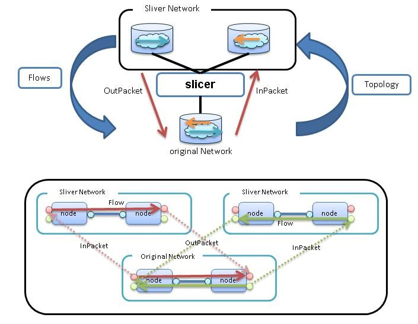
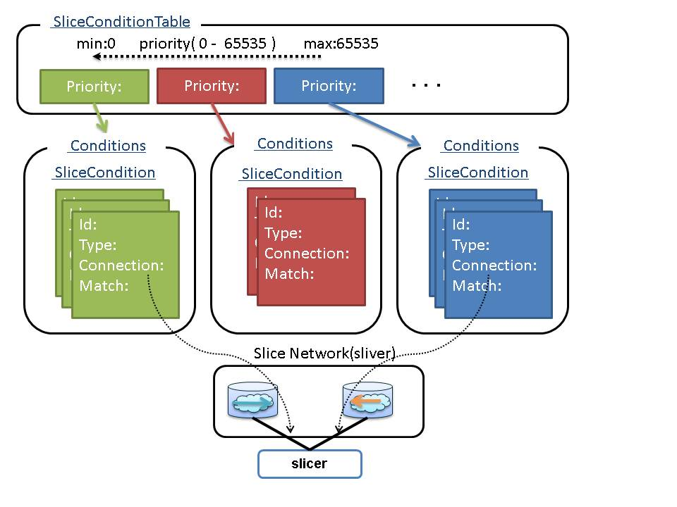


## Slicer

Slicer provides the ability to create multiple Slice Network by duplicating the Original Network.

----

### Operating specifications of the Slicer.

 * **Topology**  
 Original network and the sliver network is the same topology.  
 Update topology in the original network is reflected in the sliver network.

 * **Flows**  
 Flow will be reflected in the original network when it is set at sliver network.  
 Set to Flow, it is necessary to match the information in the [SliceConditionTable](#SliceConditionTable).  
 The status of Flow become a "failed" if the Flow of sliver network does not match the information in the [SliceConditionTable](#SliceConditionTable).

 * **Packets**  
 InPacket transfer from original network to sliver network.  
 OutPacket transfer from sliver network to original network.  
 packet become a "drop" if the packet header does not match the information in the [SliceConditionTable](#SliceConditionTable).  

 * SliceConditionTable&SliceCondition  
 [SliceCondition](#SliceCondition) has a match condition and connection information.  
 slicer does the split of Flow and Packet in match conditions.  
 Setting the Match and ConnectionId to sliceCondition. Match set the split of Flow and Packet.  
 The search order is determined by the priority.   

* **Create Instance of Slicer.**  
  Generate an instance of Slicer by performing a PUT (or POST) to the System Manager.

  [PUT \<base_uri>/components/\<comp_id>](./SystemManager.md#PUTcomponents_id)

**key** | **value** | **description**                                   
--------|-----------|--------------
id      | \<String> |Unique Identifier in ODENOS.
type    | "Slicer"  |ObjectType
cm_id   | \<String> |Specify the [componentManager.Property.id](./DataClass.md#ObjectProperty) to generate an instance. (Optional)

* **Component Connections**  
  Connection  of Slicer and Network by performing a PUT (or POST) to the System Manager.

  network        | Connection possible number | connection_type 
-----------------|----------------------------|----------------------------------
original network | Only one                   | "original"
Sliver network   | One or more                | "sliver"

  [PUT \<base_uri>/connections/\<conn_id>](./SystemManager.md#PUTconnections_id)

**key**          | **value**              | **description**                                   
-----------------|------------------------|---------------------------
id               | \<String>              |Unique Identifier in ODENOS.    
type 　　 　     | "LogicAndNetwork"      |
connection_type  | "original" or  "sliver"|                                                 
state            | none                   | default "initializing"
logic_id         | \<String>              |Slicer  ID                                 
network_id       | \<String>              |Network ID                               

----

### Data Class

  * [SliceCondition](#SliceCondition)
  * [BasicSliceCondition](#BasicSliceCondition)
  * [SliceConditionTable](#SliceConditionTable)

### REST APIs
  * [GET \<base_uri>/property](#GETproperty)
  * [PUT \<base_uri>/property](#PUTproperty)
  * [GET \<base_uri>/settings](#GETsettings)
  * [PUT \<base_uri>/settings/slice_condition_table/\<priority>](#PUTpriority)
  * [POST \<base_uri>/settings/slice_condition_table/\<priority>/conditions](#POSTproperty_conditions)
  * [PUT \<base_uri>/settings/slice_condition_table/\<priority>/conditions/\<condition_id>](#PUTproperty_conditions)
  * [DELETE \<base_uri>/settings/slice_condition_table](#DELETEslice_condition_table)
  * [DELETE \<base_uri>/settings/slice_condition_table/conditions/\<condition_id>](#DELETEslice_condition_table_condition_id)
  * [GET \<base_uri>/settings/slice_condition_table](#GETslice_condition_table)
  * [GET \<base_uri>/settings/slice_condition_table/\<priority>](#GETslice_condition_table_priority)
  * [GET \<base_uri>/settings/slice_condition_table/conditions/\<condition_id>](#GETslice_condition_table_condition_id)
  * [GET \<base_uri>/settings/slice_condition_table/connections/\<connection_id>](#GETslice_condition_table_connection_id)
  * [GET \<base_uri>/sliver_network_flow](#GETsliver_network_flow)
  * [GET \<base_uri>/original_network_flow](#GEToriginal_network_flow)

----
#### <a name="SliceCondition"> SliceCondition</a>
 **To provide rules for dividing the topology.**
 **SliceCondition is abstract class.**

**key**     | **value** | **description**
------------|-----------|--------------
id          | \<String> | ID that is unique in the ODENOS   
connection  | \<String> | Sliver's ComponentConnectionProperty.id
type        | \<String> | SliceCondition Type    

### Type
 * [BasicSliceCondition](#BasicSliceCondition)

----
#### <a name="BasicSliceCondition"> BasicSliceCondition</a>
**SliceCondition is setting Slice rules.**   
**BasicSliceCondition support mutch "in_node" and "in_port".**   

**key**     | **value** | **description**
------------|-----------|--------------
id          | \<String> | ID that is unique in the ODENOS
type        | \<String> | SliceCondition type is "BasicSliceCondition"
connection  | \<String> | Sliver's [ComponentConnection](./DataClass.md#ComponentConnection).id 
in_node     | \<String> | [Node](./DataClass.md#Node).id        
in_port     | \<String> | [Port](./DataClass.md#port).id           

###### example(JSON)
<pre>
    {    
    "id": "sliceconditon1",
    "type": "BasicSliceCondition",
    "connection":"sliver1_connection"
    "in_node": "node1",
    "in_port": "port1"
    }    
</pre>

----
#### <a name="SliceConditionTable"> SliceConditionTable</a>
**SliceConditionTable for managing the order of priority SliceCondition.**

**key**   | **value** | **description**
----------|-----------|--------------
priority  | list<SliceCondition.id> | priority : 0 ~ 65535 (65535:Max Priority) 

###### example(JSON)

<pre>
    {    
     "30": [of_slcond7, of_slcond8, of_slcond9],   
     "20": [of_slcond4, of_slcond5, of_slcond6],   
     "10": [of_slcond1, of_slcond2, of_slcond3]    
    }    
</pre>

----
#### <a name="GETproperty"> GET \<base_uri>/property</a>
  * **get Object property.**

##### [Request]:   
  * **Body** : none 

##### [Response]:
  * **Status Code** : 200
  * **Body** :  [ObjectProperty](./DataClass.md#ObjectProperty)
 
----
### <a name="PUTproperty"> PUT \<base_uri>/property</a>
  * **update Object property.**

##### [Request]:   
  * **Body** :  [ObjectProperty](./DataClass.md#ObjectProperty)

##### [Response]:
  * **Status Code** : 200
  * **Body** :  [ObjectProperty](./DataClass.md#ObjectProperty)

----
#### <a name="GETsettings"> GET \<base_uri>/settings</a>
**Get Setting Slice List.**

##### [Request]:   
 * **Body** : none 

##### [Response]:
 * **Status Code** : 200
 * **Body** :  dict\<"slice_condition_table": SliceConditionTable>

----
#### <a name="PUTpriority">PUT \<base_uri>/settings/slice_condition_table/\<priority></a>

Create a slice_condition_table/\<priority> and to set the slice condition list.  
notification event [ObjectSettingsChanged](./DataClass.md#ObjectSettingsChanged)  

##### [Request]:   
 * **Body** : List[[SliceCondition](#SliceCondition)]   

##### [Response]:
 * **Status Code** : 200
 * **Body** : List[[SliceCondition](#SliceCondition)]   

###### example(JSON)

<pre>
  [
   {"id":"condition1", "type":"BasicSliceCondition", "connection":"slice1", "in_node":"node1", "in_port":"port1"},  
   {"id":"condition2", "type":"BasicSliceCondition", "connection":"slice1", "in_node":"node1", "in_port":"port2"}  
   {"id":"condition3", "type":"BasicSliceCondition", "connection":"slice1", "in_node":"node1", "in_port":"port3"}  
  ]
</pre>

----
#### <a name="POSTproperty_conditions">POST \<base_uri>/settings/slice_condition_table/\<priority>/conditions</a>  
create of slice Conditon.id is granted automatically. (specified id is invalid)  
If slice_condition_table/\<priority> is not, slice_condition_table/\<priority> to create a new one.  
notification event [ObjectSettingsChanged](./DataClass.md#ObjectSettingsChanged)  

##### [Request]:   
 * **Body** : [SliceCondition](#SliceCondition)

##### [Response]:
 * **Status Code** : 200
 * **Body** : [SliceCondition](#SliceCondition)

###### example(JSON)

<pre>
   {  
    "type":"BasicSliceCondition",  
    "connection":"slicer_nw01",  
    "in_node":"node001",  
    "in_port":"port0011"  
   }  
</pre>

----
#### <a name="PUTproperty_conditions">PUT \<base_uri>/settings/slice_condition_table/\<priority>/conditions/\<condition_id></a>

create of slice Conditon.If you already have a slice Conditon, It will update.  
If slice_condition_table/\<priority> is not, slice_condition_table/\<priority> to create a new one.  
notification event [ObjectSettingsChanged](./DataClass.md#ObjectSettingsChanged)  

##### [Request]:   
 * **Body** : [SliceCondition](#SliceCondition)

##### [Response]:
 * **Status Code** : 200
 * **Body** : [SliceCondition](#SliceCondition)

###### example(JSON)

<pre>
   {  
    "id":"sliceconditon1",  
    "type":"BasicSliceCondition",  
    "connection":"slicer_nw01",  
    "in_node":"node001",  
    "in_port":"port0011"  
   }  
</pre>

----
#### <a name="DELETEslice_condition_table">DELETE \<base_uri>/settings/slice_condition_table</a>
**All crear slice_condition_table, and slice_condition.**

##### [Request]:   
 * **Body** : none 

##### [Response]:
 * **Status Code** : 200
 * **Body** : none 

----
#### <a name="DELETEslice_condition_table_condition_id">DELETE \<base_uri>/settings/slice_condition_table/conditions/\<condition_id></a>
**Delete this SliceCondition from the slice_condition_table.**

##### [Request]:   
 * **Body** : none 

##### [Response]:
 * **Status Code** : 200
 * **Body** : none 

----
#### <a name="GETslice_condition_table">GET \<base_uri>/settings/slice_condition_table</a>
**Get SliceConditionTable.**

##### [Request]:   
 * **Body** : none 

##### [Response]:
 * **Status Code** : 200
 * **Body** : [SliceConditionTable](#SliceConditionTable)

----
#### <a name="GETslice_condition_table_priority">GET \<base_uri>/settings/slice_condition_table/\<priority></a>
**Get a list of \<condition_id> corresponding to \<priority>.**

##### [Request]:   
 * **Body** : none 

##### [Response]:
 * **Status Code** : 200
 * **Body** : List<condition_id>

##### [Response]\(detail):
 * **Status Code** : 200
 * **Body** : List[[BasicSliceCondition](#BasicSliceCondition)]   

----
#### <a name="GETslice_condition_table_condition_id">GET \<base_uri>/settings/slice_condition_table/conditions/\<condition_id></a>
**Get SliceCondition.**

##### [Request]:   
 * **Body** : none 

##### [Response]:
 * **Status Code** : 200
 * **Body** : [BasicSliceCondition](#BasicSliceCondition)

----
#### <a name="GETslice_condition_table_connection_id">GET \<base_uri>/settings/slice_condition_table/connections/\<connection_id></a>
**Get a list of \<condition_id> corresponding to \<connection_id>.**

##### [Request]:   
 * **Body** : none 

##### [Response]:
 * **Status Code** : 200
 * **Body** : List[condition_id]

##### [Response]\(detail):
 * **Status Code** : 200
 * **Body** : List[[BasicSliceCondition](#BasicSliceCondition)]   

----
#### <a name="GETsliver_network_flow">GET \<base_uri>/sliver_network_flow</a>
**Relationship of the sliver flow id and original flow id.**
(Key is original)

##### [Request]:   
 * **Body** : none 

##### [Response]:
 * **Status Code** : 200
 * **Body** : dict\<original_flow_id, sliver_network_id::sliver_flow_id>

----
#### <a name="GEToriginal_network_flow">GET \<base_uri>/original_network_flow</a>
**Get relationship of the sliver flow id and original flow id.**
(Key is sliver)

##### [Request]:   
 * **Body** : none 

##### [Response]:
 * **Status Code** : 200
 * **Body** : dict\<sliver_network_id::sliver_flow_id, original_flow_id>

