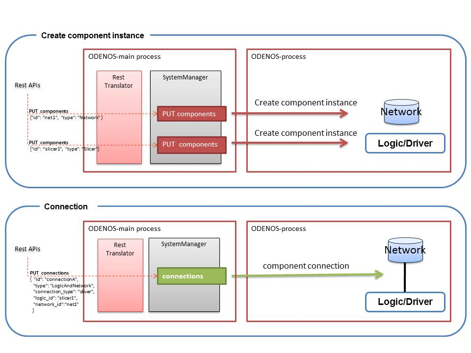

## SystemManager

**ODENOS core Component: System Manager**    
**System Manager is in charge of managing the ComponentManager, EventManager, ComponentType, Component, and ComponentConnection.**

**Followings are brief description of these components' REST API**

----

### REST APIs
  * [GET \<base_uri>/property](#GETproperty)
  * [PUT \<base_uri>/property](#PUTproperty)
  * [GET \<base_uri>/settings](#GETsettings)
  * [PUT \<base_uri>/settings](#PUTsettings)
  * [GET \<base_uri>/objects/\<object_id>](#GETobjects_id)

    Here, \<base_uri> is http://\<hostname>:10080/systemmanager
    such as http://localhost:10080/systemmanager

##### RemoteObject Manager
  * [GET \<base_uri>/component_managers](#GETcomponent_managers)
  * [GET \<base_uri>/component_managers/\<compmgr_id>](#GETcomponent_managers_id)
  * [GET \<base_uri>/component_managers/\<compmgr_id>/component_types](#GETcomponent_managers_types)
  * [PUT \<base_uri>/component_managers/\<compmgr_id>](#PUTcomponent_managers_id)
  * [DELETE \<base_uri>/component_managers/\<compmgr_id>](#DELETEcomponent_managers_id)

##### Event Manager
  * [GET \<base_uri>/event_manager](#GETevent_manager)

##### Component 
  * [GET \<base_uri>/components](#GETcomponents)
  * [GET \<base_uri>/components/\<comp_id>](#GETcomponents_id)
  * [POST \<base_uri>/components](#POSTcomponents)
  * [PUT \<base_uri>/components/\<comp_id>](#PUTcomponents_id)
  * [DELETE \<base_uri>/components/\<comp_id>](#DELETEcomponents_id)
  * [GET \<base_uri>/component_types](#GETcomponent_types)
  * [GET \<base_uri>/component_types/\<ComponentType>](#GETcomponent_types_id)

##### Component Connection
  * [GET \<base_uri>/connections](#GETconnections)
  * [GET \<base_uri>/connections/\<conn_id>](#GETconnections_id)
  * [POST \<base_uri>/connections](#POSTconnections)
  * [PUT \<base_uri>/connections/\<conn_id>](#PUTconnections_id)
  * [DELETE \<base_uri>/connections/\<conn_id>](#DELETEconnections_id)

----
#### <a name="GETproperty"> GET \<base_uri>/property</a>
get Object property.

##### [Request]:   
  * **Body** : none 

##### [Response]:
  * **Status Code** : 200
  * **Body** :  [ObjectProperty](./DataClass.md#ObjectProperty)
 
----
#### <a name="PUTproperty"> PUT \<base_uri>/property</a>
update Object property.

##### [Request]:   
  * **Body** :  [ObjectProperty](./DataClass.md#ObjectProperty)

##### [Response]:
  * **Status Code** : 200
  * **Body** :  [ObjectProperty](./DataClass.md#ObjectProperty)

----
#### <a name="GETsettings"> GET \<base_uri>/settings</a>
get Object settings.

##### [Request]:   
  * **Body** : none 

##### [Response]:
  * **Status Code** : 200
  * **Body** :  [ObjectSettings](./DataClass.md#ObjectSettings)

----
#### <a name="PUTsettings"> PUT \<base_uri>/settings</a>
set Object settings.

##### [Request]:   
  * **Body** :  [ObjectSettings](./DataClass.md#ObjectSettings)

##### [Response]:
  * **Status Code** : 200
  * **Body** :  [ObjectSettings](./DataClass.md#ObjectSettings)

----
### <a name="GETobjects_id">  GET \<base_uri>/objects/\<object_id></a>  
get RemoteObject ObjectProperty.(SystemManager, EventManager, ComponentManager, Component ..)    
\<object_id> is ObjectProperty.id

##### [Request]:   
  * **Body** : none 

##### [Response]:
  * **Status Code** : 200
  * **Body** : [ObjectProperty](./DataClass.md#ObjectProperty)

----

#### <a name="GETcomponent_managers"> GET \<base_uri>/component_managers</a>  
Get ComponentManagers list.

##### [Request]:   
  * **Body** : none 

##### [Response]:
  * **Status Code** : 200
  * **Body** :  [ComponentManager.property](./DataClass.md#ObjectProperty)

----

#### <a name="GETcomponent_managers_id"> GET \<base_uri>/component_managers/\<compmgr_id></a>  
get ComponentManagers property

##### [Request]:   
  * **Body** : none 

##### [Response]:
  * **Status Code** : 200
  * **Body** :  [ComponentManager.property](./DataClass.md#ObjectProperty)

----
#### <a name="#GETcomponent_managers_types"> GET \<base_uri>/component_managers/\<compmgr_id>/component_types</a>  
get ComponentType list.    
**ComponentType is Registered Component.Property.type**

##### [Request]:   
  * **Body** : none 

##### [Response]:
  * **Status Code** : 200
  * **Body** : dict {ComponentType:{"type" :\<string>   "super_type":\<string> , "connection_types":{\<string>: \<string>} , "description":\<string> }

##### example(JSON)
<pre>
 {
   "Aggregator"  : { "type": "Aggregator" ,  "super_type":"Aggregator" ,
                     "connection_types":{"original":"1", "aggregated":"1"}, "description":"Aggregator ...." },
   "Slicer"  : { "type": "Slicer" ,  "super_type":"Slicer" ,
                 "connection_types":{"original":"1", "Sliver":"*"}, "description":"Slicer  ...." },
   "Federator"  : { "type": "Federator" ,  "super_type":"Federator" ,
                    "connection_types":{"original":"*", "Federeted":"1"}, "description":"Federator  ...." }
   }
</pre>

**Key**          | **Value** |**Description**                            
-----------------|-----------|------------------------------------------
type             | \<String> |ObjectType (example:ComponentManager,Network,Slicer,,,)
super_type       | \<String> |super class ObjectType. (example:ComponentManager,NetworkComponent,Slicer,,,)
connection_types | dict{\<String>:\<String>} | [ComponentConnection](#ComponentConnection).connection_type : connection max num
description      | \<String> |

----
#### <a name="GETcomponent_types_id"> GET \<base_uri>/component_types/\<ComponentType></a>  
get a list of ComponentManager.property \<ComponentType> that can be created.    
\<ComponentType> is Registered Component.Property.type

##### [Request]:   
  * **Body** : none 

##### [Response]:
  * **Status Code** : 200
  * **Body** : list[[ComponentManager.property](./DataClass.md#ObjectProperty)]

----

#### <a name="PUTcomponent_managers_id"> PUT \<base_uri>/component_managers/\<compmgr_id></a>  
Registration ComponentManager in System management.    
ComponentManager register themselves the SystemManager.    
notification event "ComponentManagerChanged"  

##### [Request]:   
  * **Body** : [ComponentManager.property](./DataClass.md#ObjectProperty)

##### [Response]:
  * **Status Code** : 200
  * **Body** :  [ComponentManager.property](./DataClass.md#ObjectProperty)

----
#### <a name="DELETEcomponent_managers_id"> DELETE \<base_uri>/component_managers/\<compmgr_id></a>  
delete ComponentManager
notification event "ComponentManagerChanged"    

##### [Request]:   
  * **Body** : none 

##### [Response]:
  * **Status Code** : 200
  * **Body** : none 

----
#### <a name="GETevent_manager"> GET \<base_uri>/event_manager</a>  
get EventManagers property

##### [Request]:   
  * **Body** : none 

##### [Response]:
  * **Status Code** : 200
  * **Body** :  [EventManager.property](./DataClass.md#ObjectProperty)

----
#### <a name="GETcomponent_types"> GET \<base_uri>/component_types</a>  
get ComponentType list.    
**ComponentType is Registered Component.Property.type**

##### [Request]:   
  * **Body** : none 

##### [Response]:
  * **Status Code** : 200
  * **Body** : dict {ComponentType, [[ComponentManager.property](./DataClass.md#ObjectProperty)]}

##### [Response]:
  * **Body** : dict {ComponentType:{"type" :\<string> , "super_type":\<string> , "connection_types":{\<string>: \<string>} , "description":\<string>, "cm_id" :list[ \<string> ]  }

##### example(JSON)
<pre>
 {
   "Aggregator"  : { "type": "Aggregator" ,  "super_type":"Aggregator" ,
                     "connection_types":{"original":"1", "aggregated":"1"}, "description":"Aggregator ....",
                     "cm_id":["CompManager1", "CompManager2"]},
   "Slicer"  : { "type": "Slicer" ,  "super_type":"Slicer" ,
                 "connection_types":{"original":"1", "Sliver":"*"}, "description":"Slicer  ....",
                     "cm_id":["CompManager1", "CompManager2"]},
   "Federator"  : { "type": "Federator" ,  "super_type":"Federator" ,
                    "connection_types":{"original":"*", "Federeted":"1"}, "description":"Federator  ....",
                     "cm_id":["CompManager1", "CompManager2"]}
 }
</pre>

**Key**          | **Value** |**Description**                            
-----------------|-----------|------------------------------------------
type             | \<String> |ObjectType (example:ComponentManager,Network,Slicer,,,)
super_type       | \<String> |super class ObjectType. (example:ComponentManager,NetworkComponent,Slicer,,,)
connection_types | dict{\<String>:\<String>} | [ComponentConnection](#ComponentConnection).connection_type : connection max num
description      | \<String> |
cm_id   | list[\<String>] | [componentManager.Property.id](./DataClass.md#ObjectProperty)

----
#### <a name="GETcomponent_types_id"> GET \<base_uri>/component_types/\<ComponentType></a>  
get a list of ComponentManager.property \<ComponentType> that can be created.    
\<ComponentType> is Registered Component.Property.type

##### [Request]:   
  * **Body** : none 

##### [Response]:
  * **Status Code** : 200
  * **Body** : list[[ComponentManager.property](./DataClass.md#ObjectProperty)]

----
#### <a name="GETcomponents"> GET \<base_uri>/components</a>  
get Component instance List.

##### [Request]:   
  * **Body** : none 

##### [Response]:
  * **Status Code** : 200
  * **Body** : dict { [Component.Property](./DataClass.md#ObjectProperty).id, [Component.Property](./DataClass.md#ObjectProperty) }
  * **Note** : Component.Property is Component instance information.

----
#### <a name="GETcomponents_id"> GET \<base_uri>/components/\<comp_id></a>  
It want to get the components that are instantiated.    
\<comp_id> is Component.property.id

##### [Request]:   
  * **Body** : none 

##### [Response]:
  * **Status Code** : 200
  * **Body** : [Component.Property](./DataClass.md#ObjectProperty) 
  * **Note** : Component.Property is Component instance information.

----
#### <a name="POSTcomponents"> POST \<base_uri>/components</a>  
Component instance create.
id is granted automatically. (specified id is invalid)  
notification event "ComponentChanged"    

##### [Request]:   
  * **Body** : [Component.Property](./DataClass.md#ObjectProperty)
  * **Note** : See below.    

**key** | **value** | **description**                                   
--------|-----------|--------------
type    | \<String> |ObjectType (example:ComponentManager, Network, Aggregator, Slicer, ...)
cm_id   | \<String> |Specify the [componentManager.Property.id](./DataClass.md#ObjectProperty) to generate an instance. (Optional)

###### example(JSON)
<pre>
    {    
        "type": "Network",  "cm_id" : "compmgr_java"
    }
</pre>

#### <a name="PUTcomponents_id"> PUT \<base_uri>/components/\<comp_id></a>  
Component instance create or update.
notification event "ComponentChanged"    

##### [Request]:   
  * **Body** : [Component.Property](./DataClass.md#ObjectProperty)
  * **Note** : See below.    

**key** | **value** | **description**                                   
--------|-----------|--------------
id      | \<String> |ObjectID (unique ID of ODENOS)
type    | \<String> |ObjectType (example:ComponentManager, Network, Aggregator, Slicer, ...)
cm_id   | \<String> |Specify the [componentManager.Property.id](./DataClass.md#ObjectProperty) to generate an instance. (Optional)

###### example(JSON)

<pre>
    {    
        "id": "network1",  "type": "Network",  "cm_id" : "compmgr_java"
    }
</pre>

##### [Response]\(Update):
  * **Status Code** : 200
  * **Body** : [Component.Property](./DataClass.md#ObjectProperty)

##### [Response]\(Create):
  * **Status Code** : 201
  * **Body** : [Component.Property](./DataClass.md#ObjectProperty)

----
#### <a name="DELETEcomponents_id">  DELETE \<base_uri>/components/\<comp_id></a>  
Delete Component instance.
\<comp_id> is Component.property.id
notification event "ComponentChanged"    

##### [Request]:   
  * **Body** : none 

##### [Response]:
  * **Status Code** : 200
  * **Body** : none 

----
#### <a name="GETconnections">  GET \<base_uri>/connections</a>  
get ComponentConnection infomation.

##### [Request]:   
  * **Body** : none 

##### [Response]:
  * **Status Code** : 200
  * **Body** : dict{ComponentConnection.id, [ComponentConnection](./DataClass.md#ComponentConnection) }

----
#### <a name="GETconnections_id">  GET \<base_uri>/connections/\<conn_id></a>  
get ComponentConnection.
\<conn_id> is ComponentConnection.id

##### [Request]:   
  * **Body** : none 

##### [Response]:
  * **Status Code** : 200
  * **Body** : dict{ComponentConnection.id, [ComponentConnection](./DataClass.md#ComponentConnection) }

----
#### <a name="POSTconnections">  POST \<base_uri>/connections</a>  
create ComponentConnection.
notification event "ComponentConnectionChanged"

##### [Request]:   
  * **Body** : [ComponentConnection](./DataClass.md#ComponentConnection)

###### example(JSON)
<pre>
    {    
        "type": "LogicAndNetwork", 
        "connection_type": "original", "logic_id": "slicer1", "network_id":"network0"
    }
</pre>
##### [Response]:
  * **Status Code** : 200
  * **Body** : [ComponentConnection](./DataClass.md#ComponentConnection)

----
#### <a name="PUTconnections_id">  PUT \<base_uri>/connections/\<conn_id></a>  
update ComponentConnection.  \<conn_id> is ComponentConnection.id  
notification event "ComponentConnectionChanged"

##### [Request]:   
  * **Body** : [ComponentConnection](./DataClass.md#ComponentConnection)

###### example(JSON)
<pre>
    {    
        "id": "connection0", "type": "LogicAndNetwork", 
        "connection_type": "original", "logic_id": "slicer1", "network_id":"network0",
        "status": "initializing"
    }
</pre>

##### [Response]\(Updated):
  * **Status Code** : 200
  * **Body** : [ComponentConnection](./DataClass.md#ComponentConnection)

##### [Response]\(Created):
  * **Status Code** : 201
  * **Body** : [ComponentConnection](./DataClass.md#ComponentConnection)

----
#### <a name="DELETEconnections_id">  DELETE \<base_uri>/connections/\<conn_id></a>  
delete ComponentConnection.   \<conn_id> is ComponentConnection.id  
notification event "ComponentConnectionChanged"

##### [Request]:   
  * **Body** : none 

##### [Response]:
  * **Status Code** : 200
  * **Body** : none 
 
