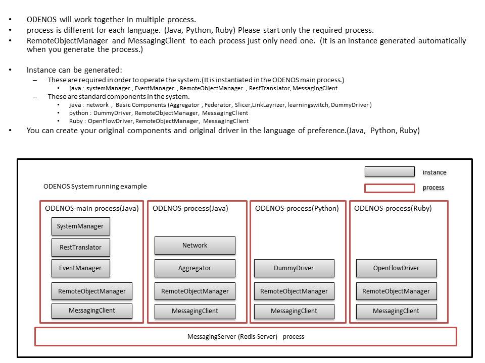
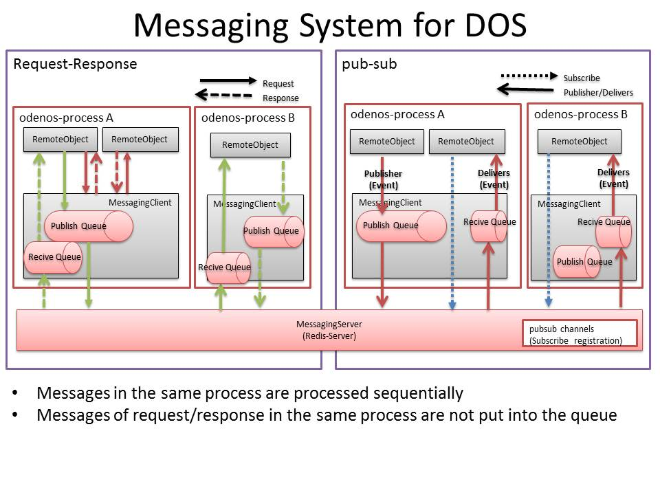


## ODENOS APIs

ODENOS is a framework for developing SDN controller.  
It is *not* SDN controller itself, but libraries (SDK).  
ODENOS is implemented with Java, Python, and Ruby language.  
It consists of following components.  
You can control these components by REST-API  

----
### REST APIs

  * ODENOS core Components
    * [SystemManager](./SystemManager.md)
    * [EventManager](./EventManager.md)
    * [ComponentManager](./ComponentManager.md)
    * [Network](./Network.md)
    * [data Classes](./DataClass.md)

  * Basic Logic Components
    * [Aggregator](./Aggregator.md)
    * [Slicer](./Slicer.md)
    * [Federator](./Federator.md)
    * [LinkLayerizer](./LinkLayerizer.md)
    * [LearningSwitch](./LearningSwitch.md)

----
### Java APIs

API of java you can to document (javadoc) in the following command.  
It will be output to the directory (./doc/java/).
<pre>
   $ mvn javadoc:javadoc
</pre>
   

API corresponding to REST to easily develop the controller is served.  

  * [SystemManager](./SystemManager.md) equivalent API is SystemManagerIF.  
  * [Network](./Network.md) equivalent API is NetworkIF.  
  * Logic equivalent API is LogicIF.  

---
### Python APIs

API of Python you can to document (javadoc) in the following command.  
It will be output to the directory (./doc/python).
<pre>
   $ doxygen ./etc/Doxyfile.python 
</pre>

API corresponding to REST to easily develop the controller is served.  

  * [SystemManager](./SystemManager.md) equivalent API is system_manager_interface.  
  * [Network](./Network.md) equivalent API is network_interface.  

----
### Ruby APIs

API of Ruby you can to document (yardoc) in the following command.  
It will be output to the directory (./doc/ruby/).
<pre>
   $ cd  ./src/main/ruby
   $ yardoc org/o3project/odenos -o ../../../doc/ruby
</pre>
   

API corresponding to REST to easily develop the controller is served.  

  * [SystemManager](./SystemManager.md) equivalent API is system_manager_interface.  
  * [Network](./Network.md) equivalent API is network_interface.  

----
## ODENOS Architecture

----
## ODENOS SystemConfiguration

----

----

